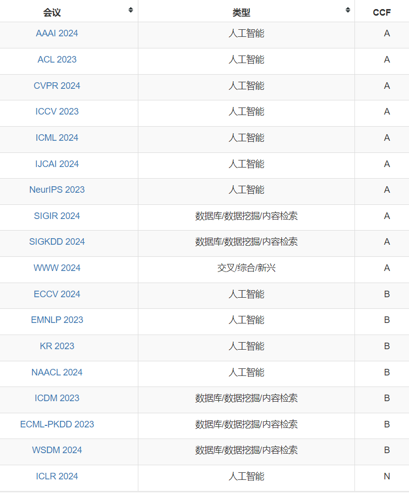
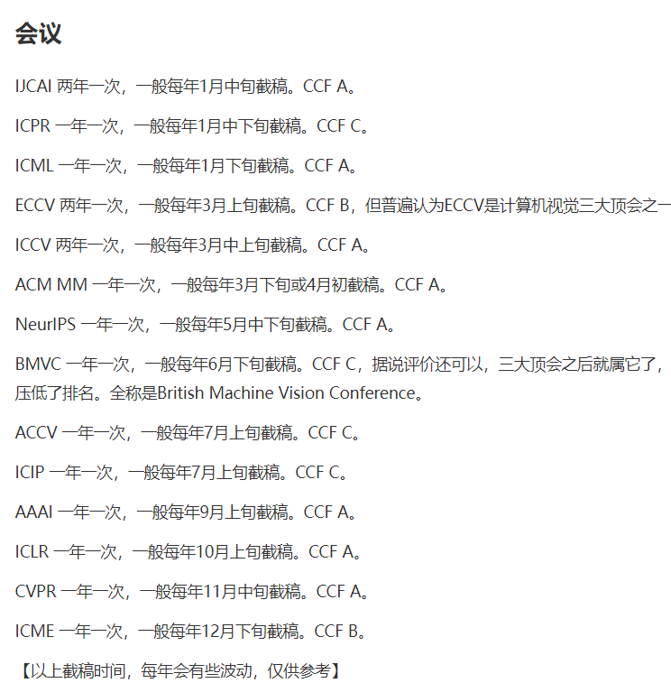
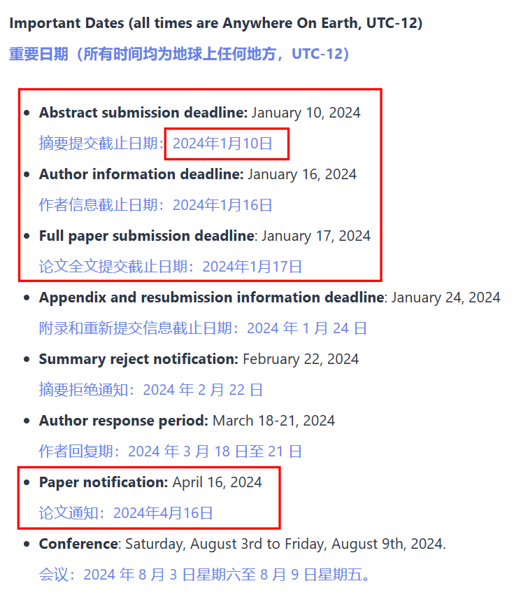
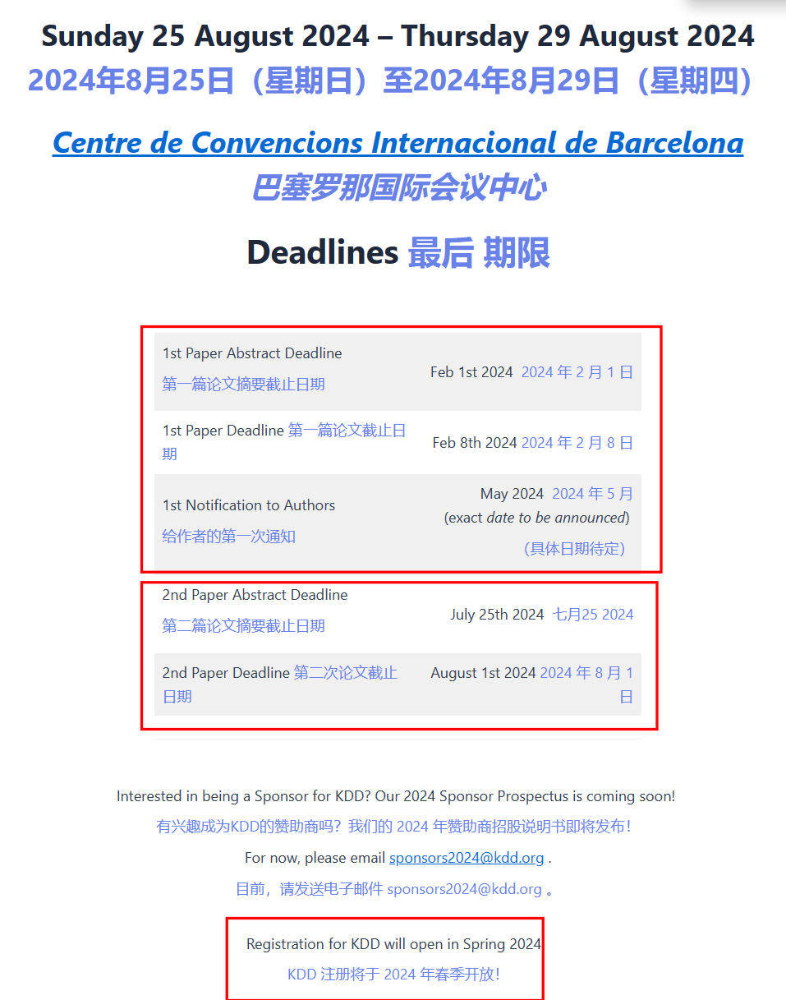
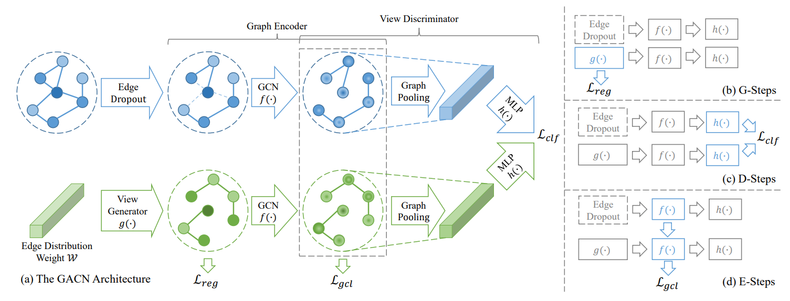
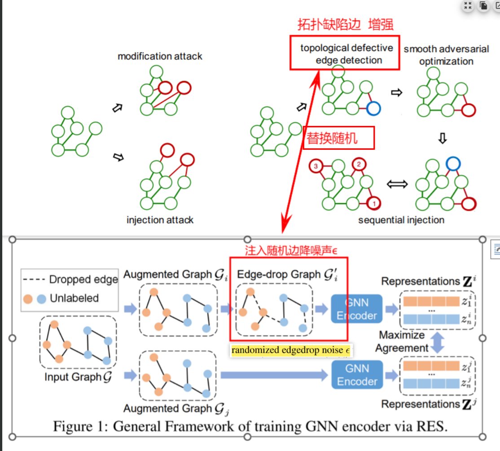
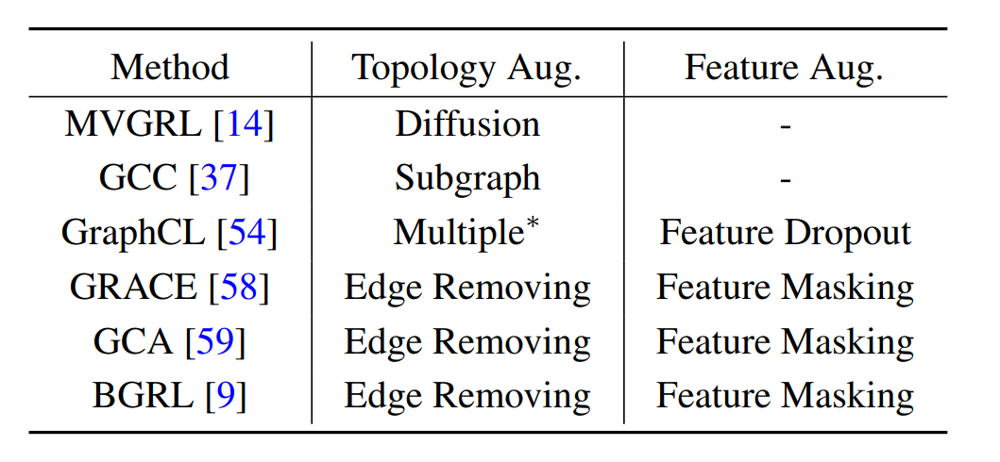

### Graph 研究热点

表达图神经网络 Expressive Graph Neural Networks

- 表达图神经网络 Expressive Graph Neural Networks
- GNN 架构（变压器、新的位置编码……）GNN architectures (transformers, new positional encodings, …)
- 等变架构 Equivariant architectures
- 图的统计理论 Statistical theory on graphs
- 因果推理（结构因果模型，……）Causal inference (structural causal models, …)
- 算法推理 Algorithmic reasoning
- 几何处理 Geometry processing
- 图的鲁棒性和对抗性攻击 Robustness and adversarial attacks on graphs
- 组合优化和图算法 Combinatorial Optimization and Graph Algorithms
- 图内核 Graph Kernels
- 图形信号处理/频谱方法 Graph Signal Processing/Spectral Methods
- 图生成模型 Graph Generative Models
- 可扩展的图学习模型和方法 Scalable Graph Learning Models and Methods
- 推荐系统的图 Graphs for Recommender Systems
- 用于计算机视觉的图形/几何 ML Graph/Geometric ML for Computer Vision
- 知识图谱 Knowledge Graphs
- 用于自然语言处理的 Graph ML Graph ML for Natural Language Processing
- 用于分子的图形/几何 ML（分子、蛋白质、药物发现……）Graph/Geometric ML for Molecules (molecules, proteins, drug discovery, …)
- 用于安全的 Graph ML Graph ML for Security
- 用于健康的 Graph ML Graph ML for Health
- 用于物理科学的图形/几何 ML Graph/Geometric ML for Physical sciences
- 图 ML 平台和系统 Graph ML Platforms and Systems
- 图上的自监督学习 Self-supervised learning on graphs
- 值得信赖的图 ML（公平、隐私……）Trustworthy graph ML (fairness, privacy, …)

---

### ==Graph 常投会议==

 

|会议|类型|CCF|
|--|--|--|
|AAAI|人工智能|A|
|ACL|人工智能|A|
|CVPR|人工智能|A|
|ICCV|人工智能|A|
|ICML|人工智能|A|
|IJCAI|人工智能|A|
|NeurIPS|人工智能|A|
|SIGIR|数据库/数据挖掘/内容检索|A|
|SIGKDD|数据库/数据挖掘/内容检索|A|
|WWW|交叉/综合/新兴|A|
|ECCV|人工智能|B|
|EMNLP|人工智能|B|
|KR|人工智能|B|
|NAACL|人工智能|B|
|ICDM|数据库/数据挖掘/内容检索|B|
|ECML-PKDD|数据库/数据挖掘/内容检索|B|
|WSDM|数据库/数据挖掘/内容检索|B|
|ICLR|人工智能|N|

---

最近的 IJCAI

KDD 

---

### 组合

GCL：**POT节点紧凑度、RES鲁棒证明、GAN视图增强、SP-A GCL视图对抗训练** 、 **TD拓扑缺陷边**

==**多视图增强的无监督图对比学习**==

- Graph Contrastive Learning with Multi-View Augmentation
- Multi-View  Augmentation for Self-Supervised Graph  Contrastive Learning

 

 

##  idea 1 图对比+TDGIA拓扑脆弱边检测 ==  { how about GCL+GAN+RES ???? }==

GAN 或者 other method 用来增强view

RES 是证明GCL的鲁棒性

 

---

## idea 2  节点紧凑POT + GNN ?

 

---

### related work（POT）

GRACE [35]首次提出了使用随机边删除和特征遮挡作为数
据增强，并以InfoNCE为目标的GCL方法。在GRACE基础上，GCA [36]通过使用自适应遮挡
和删除率来改进数据增强，使其与节点中心性相关。COSTA [34]在嵌入空间中提出特征增
强以减少采样偏差。ProGCL [25]通过重新加权负样本并采用硬负样本挖掘的方式增强GCL。

还有一些基于节点到图的GCL方法，例如DGI [21]和MVGRL [8]。受到BYOL [6]的启发，也
有一些不需要负样本 [19]或使用BCE目标函数 [31]的GCL方法。

 

 

Augmentation-Free Graph Contrastive Learning with Performance Guarantee :

关于图形扩充，许多先前的研究 [54, 34, 14, 57, 59, 58, 56] 提出了
通用图形结构数据的数据扩充技术，例如属性遮蔽，边缘去除，边缘添加，子图，图形扩散
等。具体而言，MVGRL [14] 使用图形扩散来生成具有更多全局信息的图形视图；GCC [37]
使用由随机游走引发的子图作为不同的视图。GraphCL [54] 研究了多种图级表示学习的扩充
方法。GRACE [58] 通过使用边缘移除和特征遮蔽来构造节点对。GCA [59] 提出了自适应扩
充技术，进一步考虑了重要的拓扑和属性信息。BGRL [9] 摒弃了负对的设计，但其正对的
设计仍依赖于边缘移除和特征遮蔽。

---

**Dataset Download link**
Cora https://github.com/kimiyoung/planetoid/raw/master/data
Citeseer https://github.com/kimiyoung/planetoid/raw/master/data
Pubmed https://github.com/kimiyoung/planetoid/raw/master/data
DBLP https://github.com/abojchevski/graph2gauss/raw/master/data/dblp.npz
Reddit https://s3.us-east-2.amazonaws.com/dgl.ai/dataset/reddit.zip
PPI https://s3.us-east-2.amazonaws.com/dgl.ai/dataset/ppi.zip
