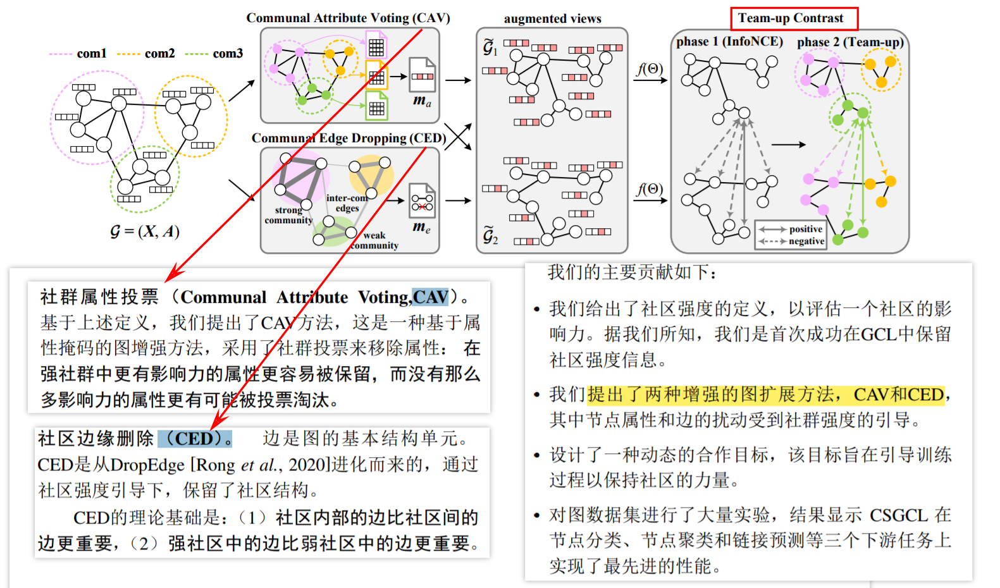
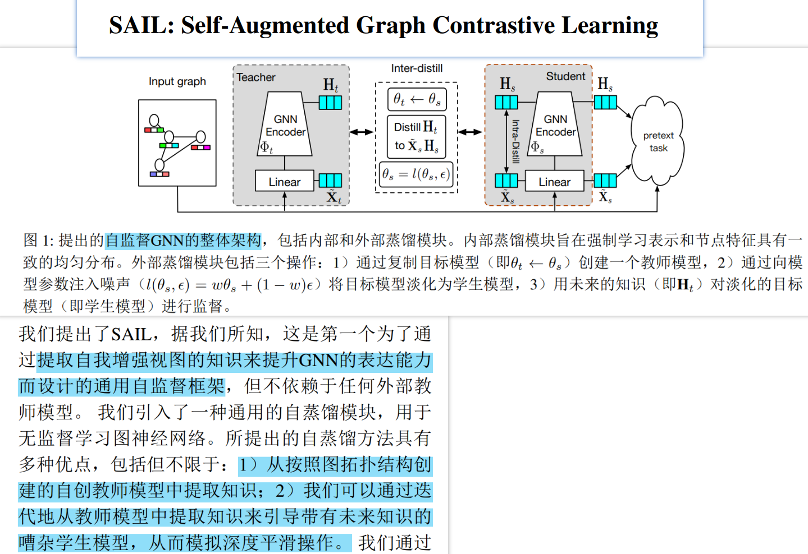

NIPS2023: 
[1]    Adversarial Training for Graph Neural Networks: Pitfalls, Solutions, and New Directions
[2]    Certifiably Robust Graph Contrastive Learning
[3]    Adversarial Robustness in Graph Neural Networks: A Hamiltonian Approach
[4]    (Provable) Adversarial Robustness for Group Equivariant Tasks: Graphs, Point Clouds, Molecules, and More

________________________________________

[1] Adversarial Training for Graph Neural Networks: Pitfalls, Solutions, and New Directions
本文贡献：

1. 理论和实际限制的克服：文章克服了先前对图学习设置中所采用的图神经网络（GNN）的理论和实际限制，并揭示了灵活的GNNs在面对对抗性扰动时的适应能力。即：训练期间已知干净的验证和测试节点，通过记忆训练图可以实现完美的鲁棒性，这可能会导致鲁棒性的错误印象。本文重新审视在完全归纳设置中结构扰动下节点分类的对抗性训练，在训练期间排除验证/测试节点，因此结果不会遇到相同的评估陷阱。
2. 可解释的学习过程: 文章提出的灵活的GNNs基于可学习的图扩散，不仅在对抗干扰方面具有鲁棒性，而且学习的信息传递方案具有自然的可解释性。
3. 针对结构扰动的攻击方法：文章引入了一种针对结构扰动的攻击方法Locally constrained Randomized Block Coordinate Descent （LR-BCD），该方法能够同时针对多个节点进行攻击，并处理全局和局部的约束。这是首次提出针对结构扰动的多节点攻击方法。
4. 对抗训练的有效性证明：通过实验证明，对抗训练是当前对抗结构扰动下的有效防御方法，相较于其他基线模型，对抗训练的模型在对抗性结构扰动下展现出更好的鲁棒性，而准确率并未显著降低。

背景知识: Transductive learning & Inductive learning
•    Inductive learning,翻译成中文可以叫做“归纳式学习”，就是从已有数据中归纳出模式来，应用于新的数据和任务。我们常用的机器学习模式，就是这样的：根据已有数据，学习分类器，然后应用于新的数据或任务。
•    Transductive learning,翻译成中文可以叫做“直推式学习”，指的是由当前学习的知识直接推到给定的数据上。其实相当于是给了一些测试数据的情况下，结合已有的训练数据，看能不能推到测试数据上。

两者区别：
模型训练：Transductive learning在训练过程中已经用到测试集数据（不带标签）中的信息，而Inductive learning仅仅只用到训练集中数据的信息。
模型预测：Transductive learning只能预测在其训练过程中所用到的样本（Specific --> Specific），而Inductive learning，只要样本特征属于同样的欧拉空间，即可进行预测（Specific --> Gerneral）模型复用性：当有新样本时，Transductive learning需要重新进行训练；Inductive Leaning则不需要。
模型计算量：显而易见，Transductive Leaning是需要更大的计算量的，即使其有时候确实能够取得相比Inductive learning更好的效果。其实，我们仅从它们的字面意思上也可以有些理解，Inductive一般翻译做归纳式，归纳是从特殊到一般的过程，即从训练集中学习到某类样本之间的共性，这种共性是普遍适用的。Transductive一般译作直推式，则显得僵硬许多，意味着必须知道它要推论的所有case长什么样时才能work
举例：开卷考和闭卷考的区别。闭卷考：学完知识之后，解题方法转化、储存在脑子里了（模型），目标是利用脑子里的知识进行“触类旁通”，解决试卷上的问题，这就是inductive。开卷考：我不知道一道题怎么解，但我记得课本上有类似的题目，我翻看课本，查到了那道题，然后通过课本上的题目的解法，推断出试卷上的题目的解法，这叫transductive。在这个例子中，课本就是训练集，试卷就是测试集，如果没有课本，inductive行不行？行。我早就学会了（已经有训练后的模型），课本啥的根本不需要。transductive行不行？不行。没有课本，我拿啥做比较、做推断？
本文：作者指出了先前研究中Transductive Leaning设置的一些局限性，包括学习设置导致评估偏差和学习架构对对抗扰动调整能力的限制。然后，作者提出了两个创新点：更具灵活性的基于可学习扩散的信息传递方案和新的攻击方法LR-BCD，通过这些改进和新方法，作者在对抗训练的鲁棒性上取得了显著的提升。
1）信息传递方案：
•    可学习的图扩散模型：传统的图神经网络（GNN）通常使用固定的图滤波器来进行信息传播，而本文"Robust Diffusion"引入了可学习的图扩散模型。通过学习扩散系数和图滤波器参数，该模型可以根据输入数据和对抗性扰动来调整信息在图结构中的传播方式，从而增强模型的稳健性和适应性。
•    对抗训练：为了使图神经网络对抗各种对抗性扰动具有鲁棒性，"Robust Diffusion"方法使用对抗训练技术。通过在训练过程中引入对抗性样本和优化目标，模型可以学习对抗性扰动下的稳健表示，并提高对抗攻击的鲁棒性。
•    多项式和谱特征："Robust Diffusion"方法还涉及到多项式逼近和谱分析。通过多项式逼近，模型可以对图滤波器进行可解释的建模，同时谱分析可以帮助理解对抗训练和扰动对学习到的图滤波器的影响
2）新的攻击方法LR-BCD
LR-BCD是一种基于梯度的攻击框架，用于对图数据中的多个节点进行攻击。它通过生成一个扰动矩阵P，并将其应用于原始邻接矩阵A，从而构建一个扰动后的邻接矩阵A˜。LR-BCD的目标是在保持节点的连接性的同时，控制扰动的规模和分布。
具体实现过程如下：
•    随机选择一个大小为b的块，其中b是指定的块大小。这意味着只考虑扰动矩阵Pt−1中的b个元素，并将其他元素设为零。这样可以保证扰动矩阵是稀疏的。
•    进行相对于损失的梯度更新，计算放松扰动St。即St←Pt−1 +αt−1∇Pt−1ℓ(Pt−1)，其中Pt−1是先前的扰动，αt−1是学习率，∇Pt−1ℓ(Pt−1)是通过GNN计算得到的扰动梯度。
•    通过投影ΠB(G)来确保扰动满足约束条件。投影的目的是将扰动矩阵离散化为{0, 1}n×n，使其满足全局和局部约束。全局投影是为了控制扰动的总体规模，而局部投影是为了保持每个节点的连接性和度数不超过一定范围。
•    重复前3个步骤，直到达到预定的迭代次数T。
通过以上步骤，LR-BCD可以生成一个满足约束条件的扰动矩阵，用于对图数据进行攻击。其中，投影操作是关键的步骤，它将连续值的扰动矩阵离散化为{0, 1}n×n的形式。总体而言，LR-BCD通过迭代地选择块并进行梯度更新，结合全局和局部投影，实现对图数据的有约束的攻击。这种方法可以灵活地控制扰动的范围和分布，同时保持节点的连接性。
实验结果：

表1中比较了Citeseer上模型之间的经验和可证明的稳健性。经过对抗训练的鲁棒扩散模型GPRGNN和ChebNetII在经验和可证明的鲁棒性方面都优于其他基线。值得注意的是，稳健性的提高并不意味着清洁精度的降低。例如，本文的LRBCD 对抗训练的GPRGNN的干净精度比GCN高1.7个百分点，而通过自适应LR-BCD攻击和ϵ=25%扰动边缘，本文的表现比GCN 高24.8个百分点。这相当于73.7%的干净准确度和70.1%的扰动准确度。表2中展示了在其他数据集上进行对抗训练的经验鲁棒性增益。从实验看出来，不仅在同质数据集上，而且在异质数据集上，稳健的扩散持续且显着地提高了鲁棒性。

________________________________________

[2] Certifiably Robust Graph Contrastive Learning
本文贡献：
    提出了第一个可证明的鲁棒GCL图对比学习框架，RES（Randomized Edgedrop Smoothing）
a)    为了解决评估和证明GCL鲁棒性中的不确定性，文章提出了一个基于潜空间中节点或图表示的语义相似性的统一标准
b)    提出了一种称为随机边缘删除平滑的新技术（解决GCL中的标签缺失并避免在认证GCL的过程中添加过多的噪声边缘）
c)    从理论上证明了鲁棒编码器学习到的表示在下游任务中可以实现可证明的鲁棒性能provably robust performance
    提出了一种通过引入随机边缘删除噪声来增强GCL的鲁棒性的有效训练方法
背景知识：Graph Contrastive Learning图对比学习

图对比学习通过创建两个增强的视图，在嵌入空间中最小化正样本之间的距离并最大化负样本之间的距离来学习表示。主要有四个方面：图增强、对比学习、对比优化目标、负样本挖掘。
具体为：
a)    通过随机数据增强为每个实例生成多个视图。正对比对由同一实例生成的两个视图，而负对比对则从不同实例中采样；
b)    这些视图被输入一组GNN encoder编码器，这些编码器可以共享权重；
c)    通过对比损失来最小化正对比对之间的距离并最大化负对比对之间的距离。

本文：

给定输入图G，通过随机数据增强从G生成两个对比视图Gi和Gj。从同一实例生成的两个视图是一对正样本，而从不同实例构造的两个视图被认为是一对负样本。然后，本文向这两个视图Gi之一注入随机边降噪声ϵ，得到Gi′。最后，使用两个GNN编码器生成视图的嵌入，并应用对比损失最大化Gi′和Gj之间的一致性。

 

★    突然一个idea，如果把本文对比学习中的随机噪声edge-drop换成其他方法，比如换成TDGIA2021中检测拓扑脆弱的边（原TDGIA检测原图脆弱边然后做毒化），然后做增强？GCL+TDGIA

本文实验结果：

表中给出了Cora，Coauthor-Physics和OGB-arxiv的结果，Raw原始图，Random随机边噪声扰动图、CLGA噪声扰动图和PRBCD噪声扰动图。从表中可以观察到：(i)当干净图上没有攻击时， RES-GRACE取得了最先进的性能，特别是在大规模数据集上，这表明通过向图中注入随机边缘丢弃噪声，RES有利于学习良好的表示。(ii)结构噪声降低了所有基准的性能。然而对RES-GRACE的影响可以忽略不计。RES-GRACE优于包括两种鲁棒GCL方法在内的所有基线，这表明RES可以消除噪声边缘的影响。
折线图中展示了不同β的结果，其中x轴表示给定扰动大小。从图中可以观察到，β控制了鲁棒性和模型效用之间的权衡。当β较大时，干净图上的认证准确性更高，但随着扰动大小的增加，下降更快。特别当β= 0.999时，认证准确性基本独立于扰动大小。作者分析表明，当β较低时，图上保留了更多的结构信息，这有利于不存在攻击情况下RES的性能，但也导致更多的噪声边在嘈杂的图上被保留，从而降低了认证准确性。相反当β较大时，图上保留的结构信息较少，可能会影响不存在攻击情况下RES的性能，但也导致在较大的扰动大小下噪声边较少，从而提高了认证准确性。

---

[3] Adversarial Robustness in Graph Neural Networks: A Hamiltonian Approach
[4] (Provable) Adversarial Robustness for Group Equivariant Tasks: Graphs, Point Clouds, Molecules, and More
这两篇文章正在进行中，已翻译完还没开始细看，作为下周任务。

---

[3] InfoGCL: Information-Aware Graph Contrastive Learning

本文贡献：
提出了一个信息感知的图对比学习框架，名为InfoGCL。该框架的关键点是遵循信息瓶颈原理，减少对比部分之间的互信息，同时在个体模块和整个框架的层次上保
持任务相关信息完整，从而最小化图表示学习过程中的信息损失。
(1): 本文的研究背景是图对比学习在图领域的应用。过去提出了多种图对比学习方法，但存在一些问题。本文旨在解决这些问题，并提出了一种信息感知的图对比学习方法。

(2): 过去的方法在设计上存在一些差异，且由于数据噪声和模型能力的限制，达到对比学习的最优性很难或不可行。然而，本文通过提出信息瓶颈原理和分解图对比学习为三个阶段的方法（增强视图设计、编码体系结构和对比目标），解决了这些问题，并为每个阶段提供了最优性解决方案，从而很好地激发了研究的动机。

(3): 本文所提出的研究方法是基于信息瓶颈原理的信息感知图对比学习框架（InfoGCL）。该框架包括三个阶段：视图增强、视图编码和表示对比。通过减少对比部分之间的互信息，同时保持任务相关信息的完整性，以最小化图表示学习中的信息损失。此外，本文还定义了最优视图、最优视图编码器和最优对比模式的概念，并提出了相应的解决方案。
    视图增强：

    视图编码

    表示对比

(4): 本文在节点分类和图分类任务上对InfoGCL模型进行了实验评估。实验结果表明，InfoGCL在这些任务上取得了显著优于现有技术的性能。该模型能够统一最近的图对比学习方法，并在节点和图分类基准数据集上取得了优异的表现，支撑了其在图学习中的目标。
【注】本文只是给出了这三个阶段的理论结果，在这三个阶段的具体操作本文并未给出。（它说将在附录中详细介绍，但是文章中并没有附录，在nips第35期的原文中也没有找到附录，也没有公布代码。）

________________________________________

[4] Provable Training for Graph Contrastive Learning

本文贡献：
    在给定不同图增强的情况下， 理论上分析了GCL中不同节点的特性， 并发现GCL方法的训练存在严重的不平衡，即，并非所有的节点都能很好地遵循GCL的原则，许多节点在GCL中始终无法得到良好的训练。
    提出了“节点紧凑度”概念，用于衡量每个节点遵循GCL原则的程度。利用界限传播方法推导出节点紧凑度作为一种正则化，并提出了GCL的可证明训练方法（POT），从而能够确凿地改进GCL的训练过程。
    POT是一个通用的插件，可以很容易地与现有的GCL方法相结合。本文在各种基准测试中评估了POT方法，充分展示出POT稳定地改进了当前的GCL基线水平。
   **== 代码：https://github.com/VoidHaruhi/POT-GCL==**
本文的节点紧凑度的概念意味着在训练过程中不应该平等对待每个节点。具体而言，GCL应该对那些已经满足InfoNCE原则的节点进行较少的关注，而应该更加关注那些对图扩充敏感且难以训练的节点。
本文从GCL的训练角度出发，通过节点紧凑的思想POT改进了训练过程，结合了四个GCL的基准模型，即POT+(GRACE、GCA、ProGCL、COSTA)做了大量的实验。实验证明POT的方法显著提高了节点分类的准确率。此外文中还给出了POT的理论证明。

---

 

---

 

 

 

---

==**四个视图**==

 

---

 

 

---

 

 

---

 

---

看不懂

