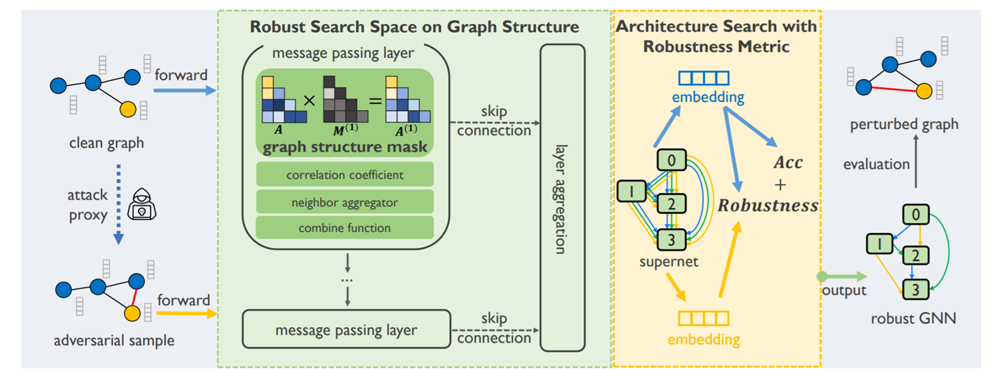

# Adversarially Robust Neural Architecture Search for Graph Neural Networks

---

---

## 背景知识

### 神经架构搜索（Neural Architecture Search，NAS）

[神经架构搜索](https://zhuanlan.zhihu.com/p/127194745?utm_medium=social&utm_oi=74269941825536)

NAS的意义在于解决深度学习模型的调参问题，是结合了优化和机器学习的交叉研究。

NAS主要的区别是深度网络结构搜索的重点在于**==如何拼接不同的结构模块和操作==**，以及==如何降低模型评估的计算消耗==。同时，近些年的研究趋势也集中在了将one-shot learning的思想引入进来减少模型评估的消耗，这个方法也被称为weight sharing[9]。在2019年，分层(Hierarchical)的思想[8]也逐渐成为了NAS的研究主流。

- NAS的研究重点之一就在于如何构造一个高效的搜索空间。NAS需要调整的知识每一层所做的操作和对应的参数。每一层的操作有不同的选择，例如可以是卷积，池化，线性变换等。Global search spaces 相对来讲比较灵活，可以允许神经网络变换出各种结构（只要设计时允许跨层连接或者层间连接），但是问题也很明显，那就是巨大的搜索空间使得很多优化算法都没办法快速解决它。
  
  
- 为了尽量减少计算消耗，不得不想办法减小搜索空间。后来主流的研究方法集中在了模块化网络结构并进行拼装（cell-based search space），这个思想主要来源于很多人工设计的结构具有很好效果，这样就可以整块的将网络结构进行组合，每一块具备一项功能，由NAS来决定每一块的位置和参数，这样一来搜索空间就降低了很多。这些cell都是一个小型的有向无环图（DAG），用来抽取和传递特征。

	

---

## 本文 （Robust+NAS）

### 主要贡献

- 开发了一个稳健的神经网络架构搜索框架
- 提出了一个新颖的鲁棒搜索空间，设计了一个鲁棒性度量
- 实验：在严重的攻击下，G-RNA在基准数据集上的表现优于最先进的鲁棒性GNN方法，提高了12.1%到23.4%。

我们首先设计了一个新颖、具有表达力和鲁棒性的搜索空间，其中包括图结构遮罩操作。图1中的绿色部分显示了细粒度的搜索空间。图结构遮罩操作覆盖了图结构的重要鲁棒性要素，并可以恢复各种现有的防御方法。我们使用基于我们设计的搜索空间构建的超网络，以单路径一次性的方式进行训练。其次，我们提出了一种能够适当衡量架构鲁棒性的鲁棒性指标。基于干净图，一个攻击代理生成了多个对抗样本。我们使用这种鲁棒性指标结合干净图和生成的对抗样本来搜索鲁棒GNN。图1中的黄色部分简要展示了鲁棒性指标。在使用进化算法搜索到最优的鲁棒GNN架构后，我们从头开始对选出的顶级鲁棒架构进行重新训练并进行评估。

### 结果

### **实验：**

