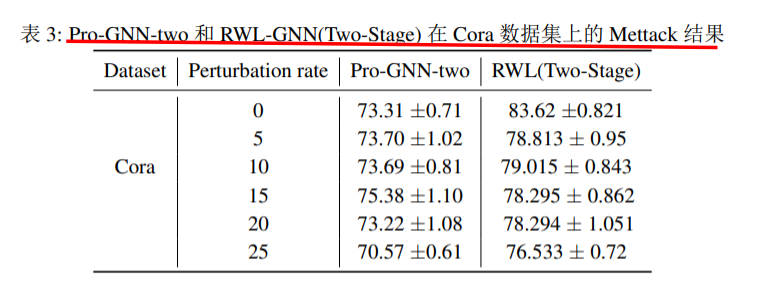

# Robust Graph Neural Networks using Weighted Graph Laplacian

---

这篇文章主要提出了两个有效的框架来增强图神经网络（GNN）的鲁棒性，并解决了在对抗攻击和噪声环境下训练GNN的挑战。

首先，作者提出了加权拉普拉斯GNN（RWL-GNN）框架，它利用加权图拉普拉斯学习和GNN相结合。这个框架通过统一的优化框架，利用拉普拉斯矩阵的正半定性、特征平滑性和潜在特征，确保对抗性/噪声边缘被丢弃并且图中的连接被适当加权。实验证明，RWL-GNN框架在精度和计算效率方面都取得了显著的改进。

其次，作者提出了两种不同的方法来实现RWL-GNN框架：分两步的方法和联合的方法。分两步的方法首先预处理图数据以去除噪声，并使用干净的图结构来学习GNN参数。联合的方法则同时解决噪声去除和GNN参数学习两个问题。

在实验部分，作者使用真实的数据集进行了大量的实验。实验结果表明，所提出的框架在对抗攻击和噪声环境下具有更高的鲁棒性和准确性。同时，该框架还能够显著降低大规模图数据处理的计算复杂性。

总的来说，该篇文章提出的RWL-GNN框架为增强GNN的鲁棒性提供了有效的解决方案，并在实验中展示了显著的表现。这些结果为解决图数据中的对抗攻击和噪声问题提供了一个有价值的研究和应用方向。

 

**提出了一种用于增强GNN鲁棒性的通用框架，称为加权拉普拉斯GNN（==RWL-GNN==）。该方法将加权图拉普拉斯学习与GNN实现相结合。所提出的方法通过制定统一的优化框架，利用拉普拉斯矩阵的正半定性性质、特征平滑性和潜在特征，确保了对抗性/噪声边缘被丢弃并且图中的连接被适当加权。**

### 实验

**我们对以下三种攻击进行了算法验证：目标攻击（Nettack）、非目标攻击（Metaself）和随机攻击。**

---

在这个部分中，作者讨论了图神经网络（Graph Neural Network，GNN）在各种应用中表现出显著性能的情况。然而，GNN容易受到输入数据中的噪声和对抗攻击的影响，因此，如何增强GNN对噪声和对抗攻击的鲁棒性是一个重要问题。现有的GNN防御方法计算量大且不可扩展。

为了解决上述问题，作者提出了一种通用框架，即加权拉普拉斯GNN（RWL-GNN），用于增强GNN的鲁棒性。该方法将加权图拉普拉斯学习与GNN实现相结合。通过制定统一的优化框架，利用拉普拉斯矩阵的正半定性、特征平滑性和潜在特征，确保对抗性/噪声边缘被丢弃并且图中的连接被适当加权。实验证明，所提出的方法在精度和计算效率上有效。

作者使用了图卷积神经网络（Graph Convolutional Neural Network，GCNN）架构进行了实验，但提出的框架也适用于其他现有的GNN架构。作者还提供了在https://github.com/Bharat-Runwal/RWL-GNN上访问的代码。

总之，本节讨论了加权拉普拉斯GNN框架的提出，该框架能够增强GNN的鲁棒性，并在精度和计算效率上取得了有效的结果。

 

 

 

本节主要讨论了图神经网络（GNN）在各个应用领域中取得的显著性能以及GNN在面对噪声和对抗攻击时的可靠性问题。在图数据中存在着恶意对抗样本，对抗攻击可能会破坏GNN的可靠性和鲁棒性。已有的GNN防御方法存在计算量大且不可扩展的问题。

针对上述问题，作者提出了一种加权拉普拉斯图神经网络（RWL-GNN）框架来增强GNN的鲁棒性。该方法使用加权图拉普拉斯学习和GNN相结合，通过优化框架确保对抗性/噪声边缘被丢弃并且图中的连接被适当加权。作者还提出了两种不同的算法实现方法：一是两阶段方法，先预处理给定的扰动/噪声图并获得干净图，然后学习GNN模型参数；二是联合方法，清理噪声图拉普拉斯矩阵并联合学习GNN模型参数。

此外，文中还提及了一些其他防御方法，如对抗训练、图纯净化、注意机制和对抗扰动检测等。然而，这些方法在防御对抗攻击时存在一些局限性。

总结来说，本节介绍了加权拉普拉斯图神经网络框架的提出，该框架可以增强GNN的鲁棒性，并提供了两种不同的算法实现方法。这些方法对于防御对抗攻击在GNN应用中具有重要意义。

 

 

这一部分主要介绍了图神经网络和对抗攻击的背景。首先解释了图神经网络（GNN）的定义特征，包括使用神经消息传递进行节点间的信息传递和神经网络进行更新。然后介绍了图卷积网络（GCN）的工作原理，它采用对称归一化聚合和自循环更新方法对局部信息进行聚合和转换。此外，还提到了其他流行的GNN模型。

接下来，介绍了对抗攻击的背景。传统的深度神经网络容易受到精心设计的对抗攻击的影响，GNN也不例外。这些攻击分为污染攻击和逃避攻击。污染攻击旨在扰乱训练图，使训练模型在目标节点上误分类。逃避攻击则是在测试时扰乱图，降低模型在所有测试数据上的性能。目标攻击进一步分为直接目标攻击和影响者攻击。

在防御方法的背景中，介绍了对抗训练和图净化方法。对抗训练将基于节点特征的对抗样本融入模型的训练过程中，而图净化方法则分为预处理法和图学习法。此外，还提到了一些增强GNN鲁棒性的方法，如使用高斯分布建模隐藏表示、基于注意力机制传递知识、量化图结构和节点特征之间的关系等。

总之，这一部分介绍了图神经网络和对抗攻击的背景，以及一些防御方法的概述。这些内容为后续讨论图神经网络的鲁棒性问题和提出新的防御方法奠定了基础。

 

 

本节的内容主要是关于图的定义和表示，以及在对抗场景中训练图神经网络的问题。一个图通过顶点集合V、边集合E和邻接矩阵W来定义，可以用拉普拉斯和邻接矩阵来表示。邻接矩阵W和拉普拉斯矩阵Φ虽然都代表同一个图，但它们具有不同的数学属性。在半监督节点分类设置中，我们目标是学习一个函数，能够将未标记的节点正确分类。然而，在对抗场景中，图信息是有噪声/扰动的，这会影响训练出可靠的预测函数。因此，提出了一个框架，在去除图噪声后训练图神经网络。具体而言，我们的目标是通过最小化噪声去除目标函数，从而在清晰的图拉普拉斯矩阵上训练GNN模型。在下一节中，将介绍解决这个问题的两种可行方法。

 

 

在这一节中，提出了一个框架来解决去噪图神经网络的问题。具体而言，通过联合优化的方式来学习鲁棒的GNN模型参数和从输入数据提取的干净图结构。该框架的目标函数包括GNN损失函数和去噪目标函数。去噪目标函数通过最小化学习的干净图拉普拉斯矩阵与带噪输入图拉普拉斯矩阵的差异以及最小化图上的狄利克雷能量来保持图的结构和促进特征的平滑性。

为了解决上述问题，可以采用两种方法：分两步的方法和联合方法。分两步的方法首先对图进行预处理以获得干净的图结构，然后使用它来学习GNN参数。而联合方法则同时解决噪音去除和GNN参数学习两个问题。

在下一节中，将介绍一种通用且计算效率高的方法来解决上述问题。具体而言，将提出一个两阶段的优化框架，第一阶段是解决噪音去除的目标，第二阶段是使用去噪后的图来学习鲁棒的GNN模型。

阶段1中，通过引入拉普拉斯算子，将矩阵约束简化为非负向量约束。最终的目标是最小化一个拉普拉斯结构约束矩阵优化问题。

总之，本节介绍了一个框架以解决去噪图神经网络的问题，提出了分两步和联合方法两种可行的解决方案，并详细说明了两阶段优化框架中的解决方法。

 

本节 error 

 

在本节中，我们提供了针对不同类型的对抗性攻击的实验结果来验证我们的防御框架。我们在Cora和Citeseer这两个常用的引文网络数据集上进行了实验，并与其他最先进的方法进行了比较，包括ProGNN、GNNGuard和GCN-Jaccard。我们遵循了之前研究的实验设置，并对三种攻击进行了验证：目标攻击、非目标攻击和随机攻击。我们使用了deeprobust库来实施攻击和GCN架构。

在实验结果中，我们提供了不同攻击下不同扰动率的节点分类准确性结果。同时，我们使用了我们提出的两阶段框架与Pro-GNN的双阶段变体进行了性能比较。结果显示，在所有扰动率下，我们的两阶段框架表现更好，并且所需的训练轮数更少。我们的框架在大多数情况下都能以较大的优势超越其他方法，但在某些情况下可能表现不及其他方法。

总之，我们的实验结果验证了我们的防御框架在不同类型的对抗性攻击下的有效性，并展示了框架相对于其他方法的优势。在未来的工作中，我们将继续改进和拓展我们的框架。

 

 

在本节中，我们介绍了两个防御对图神经网络恶意攻击的计算效率高的框架。第一个框架是RWL-GNN（两阶段）框架，它利用加权图拉普拉斯矩阵、正半定性和特征平滑性来清理图结构，并在干净的图上学习模型参数。第二个框架是RWL-GNN（联合）框架，它同时清理图并学习GNN模型的参数。通过一系列实验，我们展示了这两个框架的有效性，并证明了两阶段框架收敛到最优权重。此外，我们的框架也易于适配其他现有的GNN结构。

参考文献： 1. Haitham Ashoor等人的《Graph embedding and unsupervised learning predict genomic sub-compartments from hic chromatin interaction data》 2. Jinyin Chen等人的《Adversarial detection on graph structured data》 3. Hanjun Dai等人的《Adversarial attack on graph structured data》 4. Negin Entezari等人的《All you need is low (rank): Defending against adversarial attacks on graphs》 5. Fuli Feng等人的《Graph adversarial training: Dynamically regularizing based on graph structure》 6. Samuel G. Finlayson等人的《Adversarial attacks against medical deep learning systems》 7. Zhan Gao等人的《Stochastic graph neural networks》 8. Simon Geisler等人的《Robustness of graph neural networks at scale》 9. Justin Gilmer等人的《Neural message passing for quantum chemistry》 10. Ian Goodfellow等人的《Explaining and harnessing adversarial examples》 11. William L. Hamilton的《Graph representation learning》 12. William L. Hamilton等人的《Inductive representation learning on large graphs》 13. Vassilis N. Ioannidis等人的《Graphsac: Detecting anomalies in large-scale graphs》 14. Wei Jin等人的《Adversarial attacks and defenses on graphs: A review, a tool and empirical studies》
