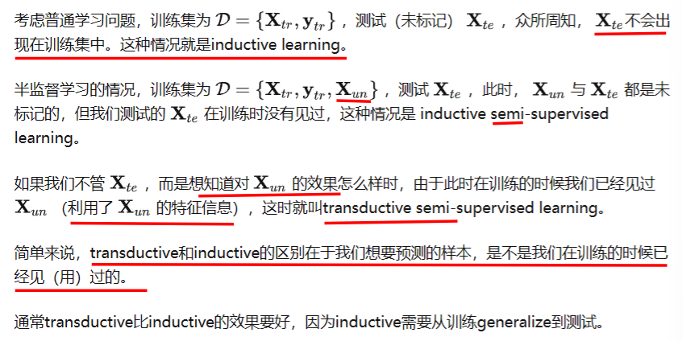
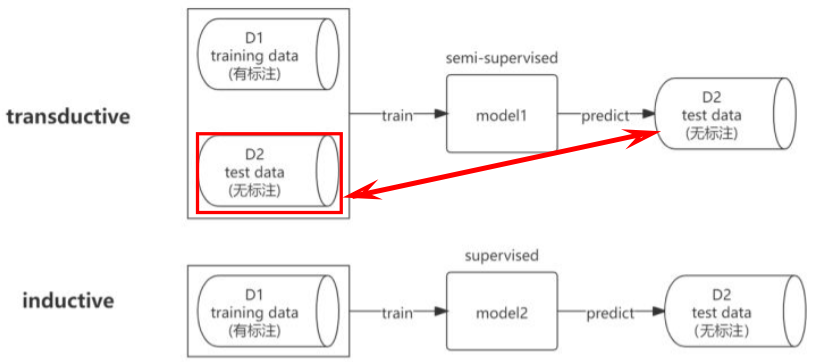

## [1] Adversarial Training for Graph Neural Networks: Pitfalls, Solutions, and New Directions

本文贡献：

1. 理论和实际限制的克服：文章克服了先前对图学习设置中所采用的图神经网络（GNN）的理论和实际限制，并揭示了灵活的GNNs在面对对抗性扰动时的适应能力。==即：训练期间已知干净的验证和测试节点，通过记忆训练图可以实现完美的鲁棒性，这可能会导致鲁棒性的错误印象。本文重新审视在完全归纳设置中结构扰动下节点分类的对抗性训练，在训练期间排除验证/测试节点，因此结果不会遇到相同的评估陷阱。==
2. 可解释的学习过程: 文章提出的灵活的GNNs基于可学习的图扩散，不仅在对抗干扰方面具有鲁棒性，而且学习的信息传递方案具有自然的可解释性。
3. 针对结构扰动的攻击方法：文章引入了一种针对结构扰动的攻击方法Locally constrained Randomized Block Coordinate Descent （LR-BCD），该方法能够同时针对多个节点进行攻击，并处理全局和局部的约束。这是==首次提出针对结构扰动的多节点攻击方法==。
4. 对抗训练的有效性证明：通过实验证明，对抗训练是当前对抗结构扰动下的有效防御方法，相较于其他基线模型，对抗训练的模型在对抗性结构扰动下展现出更好的鲁棒性，而准确率并未显著降低。

---

### 背景知识: Transductive learning & Inductive learning

- Inductive learning,翻译成中文可以叫做"归纳式学习”，就是从已有数据中归纳出模式来，应用于新的数据和任务。我们常用的机器学习模式，就是这样的：根据已有数据，学习分类器，然后应用于新的数据或任务。
- Transductive learning,翻译成中文可以叫做“直推式学习”，指的是由当前学习的知识直接推到给定的数据上。其实相当于是给了一些测试数据的情况下，结合已有的训练数据，看能不能推到测试数据上。

 

两者区别：

模型训练：Transductive learning在训练过程中已经用到测试集数据（不带标签）中的信息，而Inductive learning仅仅只用到训练集中数据的信息。

模型预测：Transductive learning只能预测在其训练过程中所用到的样本（Specific --> Specific），而Inductive learning，只要样本特征属于同样的欧拉空间，即可进行预测（Specific --> Gerneral）模型复用性：当有新样本时，Transductive learning需要重新进行训练；Inductive Leaning则不需要。

模型计算量：显而易见，Transductive Leaning是需要更大的计算量的，即使其有时候确实能够取得相比Inductive learning更好的效果。其实，我们仅从它们的字面意思上也可以有些理解，Inductive一般翻译做归纳式，归纳是从特殊到一般的过程，即从训练集中学习到某类样本之间的共性，这种共性是普遍适用的。Transductive一般译作直推式，则显得僵硬许多，意味着必须知道它要推论的所有case长什么样时才能work

举例：开卷考和闭卷考的区别。什么叫闭卷考？你学完知识之后，解题方法转化、储存在你的脑子里了，你的目标是利用你脑子里的知识进行“触类旁通”，解决试卷上的问题，这就是inductive。什么叫开卷考？你不知道一道题怎么解，但你记得课本上有类似的题目，你翻看课本，查到了那道题，然后你通过课本上的题目的解法，推断出试卷上的题目的解法，这叫transductive。在这个例子中，课本就是训练集，试卷就是测试集，我不给你课本，inductive行不行？行。我早就学会了，课本啥的根本不需要。transductive行不行？不行。你不给我课本，我拿啥做比较、做推断？

本文：作者指出了先前研究中Transductive Leaning设置的一些局限性，包括学习设置导致评估偏差和学习架构对对抗扰动调整能力的限制。然后，作者提出了==两个东西==：更具灵活性的==基于可学习扩散的信息传递方案==和==新的攻击方法LR-BCD==，通过这些改进和新方法，作者在对抗训练的鲁棒性上取得了显著的提升。

1）信息传递方案：

- 可学习的图扩散模型：传统的图神经网络（GNN）通常使用固定的图滤波器来进行信息传播，而本文"Robust Diffusion"引入了可学习的图扩散模型。通过学习扩散系数和图滤波器参数，该模型可以根据输入数据和对抗性扰动来调整信息在图结构中的传播方式，从而增强模型的稳健性和适应性。
- 对抗训练：为了使图神经网络对抗各种对抗性扰动具有鲁棒性，"Robust Diffusion"方法使用对抗训练技术。通过在训练过程中引入对抗性样本和优化目标，模型可以学习对抗性扰动下的稳健表示，并提高对抗攻击的鲁棒性。
- 多项式和谱特征："Robust Diffusion"方法还涉及到多项式逼近和谱分析。通过多项式逼近，模型可以对图滤波器进行可解释的建模，同时谱分析可以帮助理解对抗训练和扰动对学习到的图滤波器的影响

2）新的攻击方法LR-BCD

LR-BCD是一种基于梯度的攻击框架，用于对图数据中的多个节点进行攻击。它通过生成一个扰动矩阵P，并将其应用于原始邻接矩阵A，从而构建一个扰动后的邻接矩阵A˜。LR-BCD的目标是在保持节点的连接性的同时，控制扰动的规模和分布。

具体实现过程如下：

- 随机选择一个大小为b的块，其中b是指定的块大小。这意味着只考虑扰动矩阵Pt−1中的b个元素，并将其他元素设为零。这样可以保证扰动矩阵是稀疏的。
- 进行相对于损失的梯度更新，计算放松扰动St。即St ← Pt−1 + αt−1∇Pt−1ℓ(Pt−1)，其中Pt−1是先前的扰动，αt−1是学习率，∇Pt−1ℓ(Pt−1)是通过GNN计算得到的扰动梯度。
- 通过投影ΠB(G)来确保扰动满足约束条件。投影的目的是将扰动矩阵离散化为{0, 1}n×n，使其满足全局和局部约束。全局投影是为了控制扰动的总体规模，而局部投影是为了保持每个节点的连接性和度数不超过一定范围。
- 重复步骤1-3，直到达到预定的迭代次数T。

通过以上步骤，LR-BCD可以生成一个满足约束条件的扰动矩阵，用于对图数据进行攻击。其中，投影操作是关键的步骤，它将连续值的扰动矩阵离散化为{0, 1}n×n的形式。总体而言，LR-BCD通过迭代地选择块并进行梯度更新，结合全局和局部投影，实现对图数据的有约束的攻击。这种方法可以灵活地控制扰动的范围和分布，同时保持节点的连接性。