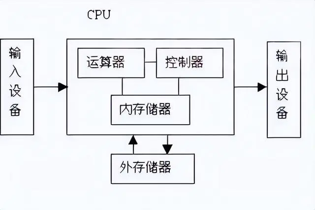
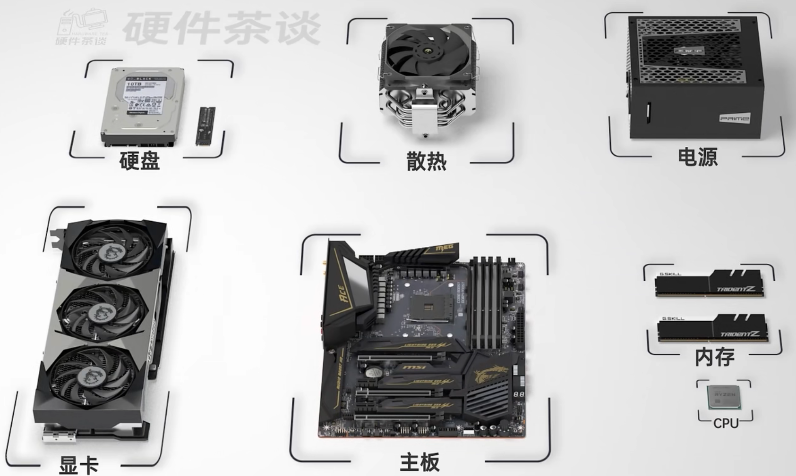
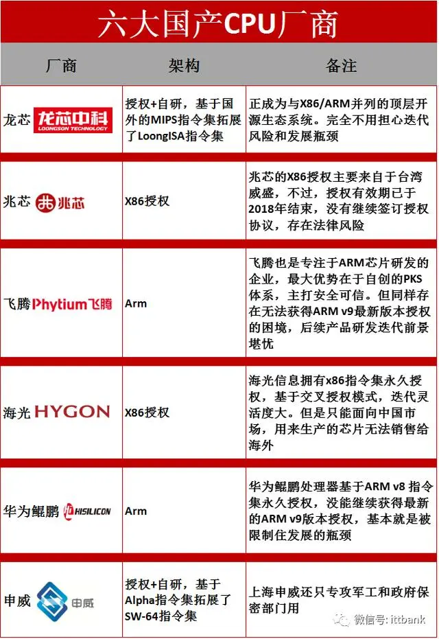
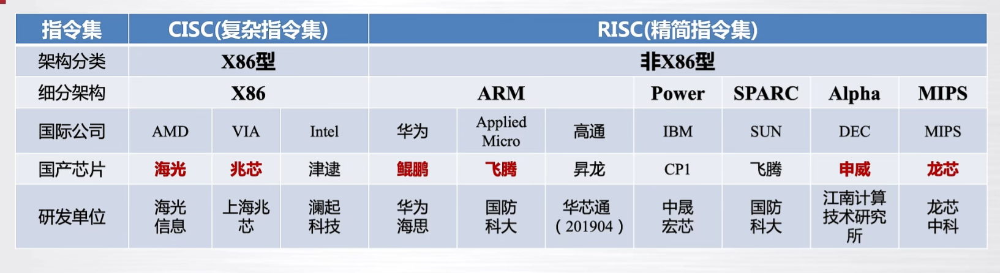
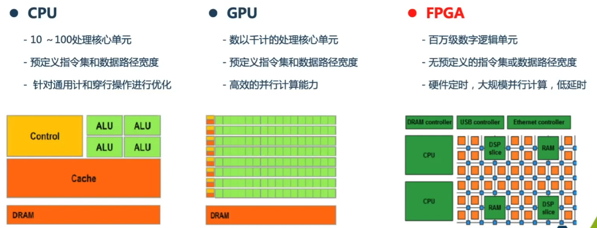
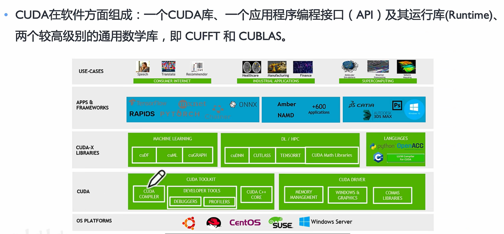
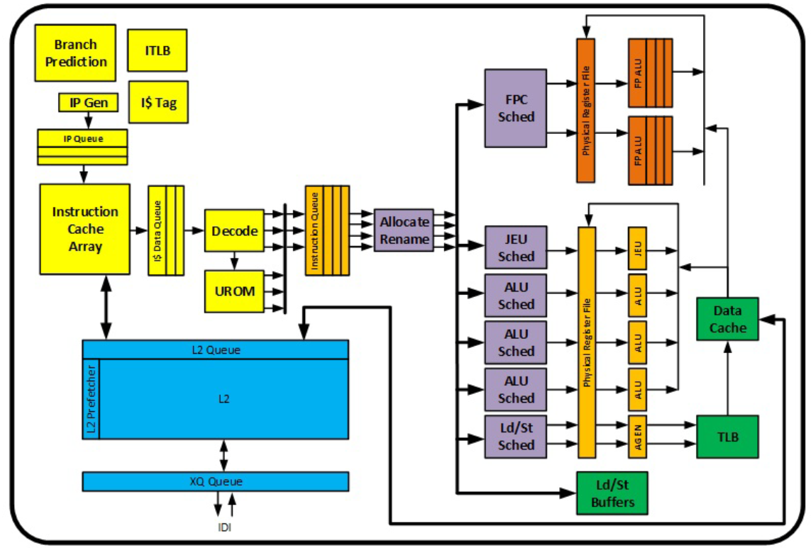

冯诺依曼体系结构：现代计算机的核心架构，可以抽象为五个基础组件：运算器、控制器、存储器、输入设备和输出设备。

1、控制器
它是计算机的指挥中心，是计算机的指挥中心，负责决定执行程序的顺序，给出执行指令时机器各部件所需要的操作控制命令。就跟人的大脑里的神经中枢一样。

控制器的组成

a. 程序计数器（PC，Program Counter）

程序计数器顾名思义就是用来记录程序执行了几个了，执行到哪了。还有就是可以存放下一条指令的地址，它与存储器之间有一条直接通路。执行指令时，首先需要根据程序计算器PC

存放的指令地址，将指令由内存取到指令寄存器IR,完成取指令的操作。也就是每执行一条指令，程序计数器就会自动加1，记录当前执行指令的位置。以便下次执行的时候，继续执行上一次的指令。

b. 指令寄存器（IR，Instruction Register）

程序执行的时候需要拿指令，这个指令的数据需要先从内存取到数据寄存器 ， 然后再发送到指令寄存器。

数据寄存器是用来存放相关指令信息或是数据信息的硬件设备。一般情况下，当用户对计算机发出操作指令的时候，

相关的指令或者数据就会暂时存放至寄存器，并做好准备让中央处理器对数据或者指令进行处理，进而完成计算机对原先用户指令的相关操作和反应。

指令寄存器根据指令在存储器中的地址（由指令地址计数器给出），把指令从存储器中取除了之后，需要有一个专门存放指令的地方，以便对指令进行分析和执行。这个专门存放现行指令的部件叫做指令寄存器。

c. 指令译码器（ID，Instruction Decoder）

在计算机执行一条指定的指令时，必须首先分析这条指令的操作码是什么，以决定操作的性质和方法，然后控制计算机的其他各部件协同完成指令表达的功能，这中间的分析工作就是指令译码器ID完成的。

其实说白了，这个指令译码器相当于战争时期，破译电台的译码专家。截获并分析对方的指令，看看对方想干嘛。

e. 时序产生器（Timing Generator）

这个类似于“时间作息表”的东西，使计算机可以准确、迅速、有条不紊地工作。机器一旦被启动，即CPU开始取指令并开始执行指令时，操作控制器就利用定时脉冲的顺序和不同的脉冲间隔，有条理、有节奏地指挥机器的动作，规定在这个脉冲到来时做什么，在那个脉冲到来时又做什么，给计算机各部分提供工作需的时间标志。

f. 操作控制器（Control Unit）

根据指令所需完成的操作和信号，发出各种微操作命令序列，用以控制所有被控对象，完成指令的执行。

2、运算器
它是计算机处理数据的功能部件，用来对数据的算术运算和逻辑数据的逻辑操作运算，相当于人脑。

组成：算术逻辑单元（ALU）、累加器、状态寄存器、通用寄存器组。

运算器的基本操作包括加、减、乘、除四则运算，与、或、非、异或等逻辑操作，以及移位、比较和传送等操作，亦称算术逻辑部件（ALU）。计算机运行时，运算器的操作和操作种类由控制器决定。运算器处理的数据来自存储器；处理后的结果数据通常送回存储器，或暂时寄存在运算器中。

3、存储器
存储器分为内部存储器和外部存储器，我们常听说的RAM和ROM就是内部存储器。硬盘、软盘、光盘和U盘就是外部存储器。存储器是一种利用了半导体技术做成的电子设备用来存储数据，电子电路的数据是以二进制的方式存储，存储器的每一个存储单元称做记忆元。存储器对应着内存和硬盘，相当于人的记忆能力。内存是短时间存储，存取速度快，相当于人的短期记忆，而硬盘是永久保存数据的，相当于人的长期记忆，但存取速度比较慢。

4、输入设备
它是接收外界数据的工具，如键盘、鼠标、相当于人的眼睛或耳朵。

5、输出设备
计算机向外输出数据的工具，如显示器、打印机。相当于人通过眼睛获取外界信号后，经过大脑处理，通过嘴巴说出来，然后写出来。

最后，运算器和控制器组成了现代计算机的CPU，存储器对应着内存和硬盘，主板控制着CPU、内存、硬盘、输出/输入设备之间的通讯。

***

https://baijiahao.baidu.com/s?id=1767223654060150169&wfr=spider&for=pc

cuDF：cuDF是NVIDIA提供的一个基于GPU的数据分析和处理库。它提供了类似于Pandas的API和功能，但在GPU上执行操作，以加速数据处理任务。cuDF可以处理大规模的数据集，并利用GPU的并行计算能力来加速数据的加载、转换、过滤和聚合等操作。cuDF还与其他GPU加速库和工具（如cuML和cuGRAPH）集成，以提供更全面的数据分析和机器学习功能。

cuML：cuML是NVIDIA提供的一个基于GPU的机器学习库。它提供了一系列常见的机器学习算法和函数，如线性回归、逻辑回归、决策树、随机森林、聚类等，以及与数据预处理、特征工程和模型评估相关的功能。cuML利用GPU的并行计算能力，加速了这些机器学习算法的训练和推理过程，以提供更快速和高效的机器学习解决方案。

cuGRAPH：cuGRAPH是NVIDIA提供的一个基于GPU的图分析和图计算库。它提供了一系列图算法和函数，如最短路径、连通组件、PageRank、图聚类等，以及与图数据的加载、转换和可视化相关的功能。cuGRAPH利用GPU的并行计算能力，加速了这些图算法的执行，以实现更快速和高效的图分析和图计算任务。

这些库都是为了利用GPU的并行计算能力，加速数据处理、机器学习和图分析等任务而设计的。它们与其他GPU加速库和工具（如cuDNN、TensorRT和CUTLASS）集成，形成了一个全面的GPU加速生态系统，为数据科学家和研究人员提供了强大的工具和平台来处理和分析大规模的数据集。

cuDNN：cuDNN（CUDA Deep Neural Network）是NVIDIA提供的一个用于深度学习的GPU加速库。它为深度神经网络的训练和推理提供了高性能的GPU加速功能。cuDNN提供了一系列高度优化的算法和函数，用于加速卷积神经网络（CNN）、循环神经网络（RNN）和生成对抗网络（GAN）等常见深度学习模型的计算。

CUTLASS：CUTLASS是NVIDIA开源的一个用于矩阵乘法计算的C++模板库。它提供了一组高度优化的矩阵乘法算法和函数，用于在GPU上进行高性能的矩阵乘法计算。CUTLASS的设计目标是提供灵活、高效的矩阵乘法实现，以满足不同的应用需求和硬件架构。

TensorRT：TensorRT是NVIDIA推出的一个用于深度学习推理的高性能推理引擎。它通过优化和加速深度学习模型的推理过程，提供了低延迟和高吞吐量的推理性能。TensorRT支持常见的深度学习框架，如TensorFlow、PyTorch和ONNX等，并提供了一组API和工具，用于在GPU上进行深度学习模型的优化和部署

 

|项目|内容|
|--|--|
|电脑型号|技嘉 C246-WU4 台式电脑|
|操作系统|Windows 11 专业版 64位（Version 21H2 / DirectX 12）|
|处理器|英特尔 Core i9-9900K @ 3.60GHz 八核|
|主板|技嘉 C246-WU4-CF（C246 芯片组）|
|显卡|NVIDIA GeForce RTX 2080 Ti ( 11 GB / 华硕 )|
|内存|32 GB ( 威刚 DDR4 2666MHz 16GB x 2 )|
|主硬盘|西数 WDC PC SN720 SDAPNTW-512G-1101 (512 GB / 固态硬盘)|
|显示器|华硕 AUS32B2 ASUS XG32VQR ( 31.5 英寸  )|
|声卡|瑞昱  @ 英特尔 High Definition Audio 控制器|
|网卡|英特尔 Ethernet Connection I219-LM / 技嘉|

 

 

### front-end 前端

Front-end的主要目的就是从内存里提取各种各样的X86指令，然后对指令进行译码，融合优化等操作，把X86指令转化为最适合执行单元执行的微指令流传递给执行单元。

- L1指令Cache：用于缓存即将执行的指令，从L2Cache中存储指令以供后续流水线使用。
- 指令提取单元（Instruction Fetch）和预解码（PreDecode）：指令提取单元，目的是从L1中把要执行的指令拿过来并且做预解码，预解码是将一个Cacheline（64字节）的X86指令提取出来并划分边界。
- 指令队列（Instruction Queue）和指令融合（Macro-Fusion）：Instruction Queue, Macro-Fusion: 指令队列与指令融合，目的是接受来自指令提取单元的指令，并把相近的X86指令融合为一条指令。
- 5-way Decode：将X86的可变长度复杂指令转换为定长的微指令。包括一个复杂解码器和四个简单解码器。
- 微指令排序器（MicroCode Sequencer ROM）：用于解析复杂指令，并发出微指令序列（uop）。
- 堆栈引擎（Stack Engine）：对于程序中经常遇到的push, pop, call, ret等操作，这些操作是专门对堆栈进行操作的指令，Stack Engine会专门处理这些指令。如果没有Stack Engine,这些操作会占用ALU（算数逻辑单元）的资源，而ALU是专门用作运算的，将这些操作交给Stack Engine，ALU则可以专注运算，提升CPU的性能。
- 解码流缓冲区（Decoded stream Buffer，DSB）：解码流缓冲区，准确的说就是X86指令在进行译码之后生成的微指令可以直接存在DSB里，DSB相当于也是一个Cache，只用于存储译码后的微指令.DSB的存在增强了指令的灵活性，微指令一样可以存在L1 指令Cache里，但可以经过DSB直接到达MUX。
- NUX：选择器。
- 分配队列（Allocation Queue，IDQ）：分配队列作为前端与执行单元的接口，是Core前端的最后的一个部件。分配队列的目的是将微指令进行重新整合与融合，发给执行单元进行乱序执行。分配队列又包含了Loop Stream Detector(LSD) 循环流检测器，对循环操作进行优化与 up-Fusion(微指令融合单元)。融合是为了让后续解码单元更有效率并且节省ROB（re-order buffer）的空间。

### Execution Engin 执行单元

- 重新排序缓冲区（re-order buffer，ROB）：重新排序缓冲区。ROB的存在ROB的目的为存储out-of-order的处理结果，作为EU的入口兼部分出口，它是乱序执行的最基本保证。当指令被传如ROB中，微指令流会以顺序执行的方式传入到后面的RS，在经过ROB时，会占用ROB的一个位置，这个位置是存储微指令乱序执行处理完成时候的结果，之后经过整合会顺序写回到相应的寄存器。而微指令在经过ROB时候会做一些优化。（消除寄存器移动，置零指令与置一指令等）。此外对于超线程中的寄存器别名技术在此经过RAT（寄存器别名表）进行寄存器重命名。
- 统一调度保留站（Scheduler unified reservation station，RS）：统一调度保留站。指令经过前面千辛万苦来到这里，此时微指令不在融合在一起，而是被单独的分配给下面各个执行单元，从架构图中可以看到，RS下面挂载了八个端口，每个端口后面挂载不同的执行模块应对不同的指令需求。

### 数据缓存

图中紫色的模块，在EU（执行单元）在执行指令时候，L1数据Cache负责供给执行指令期间所需要的数据。从图中可以看到L1数据缓存是8-路并行数据缓存，L1数据缓存可以通过数据页表地址缓存从L2提取数据与存储数据。

# 运行基础

## `torch.tensor`：基础数据结构

## `torch.autograd`：自动微分模块

# `torch.utils`

## 支持神经网络相关的数据预处理。

## 数据导入与处理

### `utils.data`

### `utils.datasets`

## `utils.tensorboard`：训练结果的可视化

## `utils.model_zoo`：预训练模型

# `torch.nn`

## 构建神经网络结构的基本元素。

## `nn.Module`：神经网络的各种结构“层”

## `nn.functional`：神经网络的损失函数与激活函数

# `torch.optim`

## 神经网络的算法优化模块，封装着各类优化器。

# 神经网络的训练

## `torch.torchelastic`：分布式训练

## `torch.cuda`：在GPU上训练

# `torch.JIT`

## 生产环境中部署的模块。

 

|序号|模块|描述|
|--|--|--|
|1|torch.tensor|基础数据结构|
||torch.autograd|自动微分模块|
|2|torch.utils|支持神经网络相关的数据预处理。|
||utils.data|数据导入与处理|
||utils.datasets||
||utils.tensorboard|训练结果的可视化|
||utils.model_zoo|预训练模型|
|3|torch.nn|构建神经网络结构的基本元素。|
||nn.Module|神经网络的各种结构“层”|
||nn.functional|神经网络的损失函数与激活函数|
|4|torch.optim|神经网络的算法优化模块，封装着各类优化器。|
|5|torch.torchelastic|分布式训练|
||torch.cuda|在GPU上训练|
|6|torch.JIT|生产环境中部署的模块。|
|7|torchvision计算机视觉|torchvision.datasets: CV常用数据 torchvision.models: CV常用模型 torchvision.transforms: 图像数据的预处理工具|
|8|torchtext自然语言处理|torchtext.data: 文字数据的数据预处理 torchtext.datasets: NLP领域的常用数据集|
|9|torchaudio语音处理|torchaudio.datasets: 语音领域的常用数据集 torchaudio.transforms: 语音领域的预处理工具 torchaudio.models: 语音领域的常用模型 torchaudio.functional: 语音领域的常用函数|
