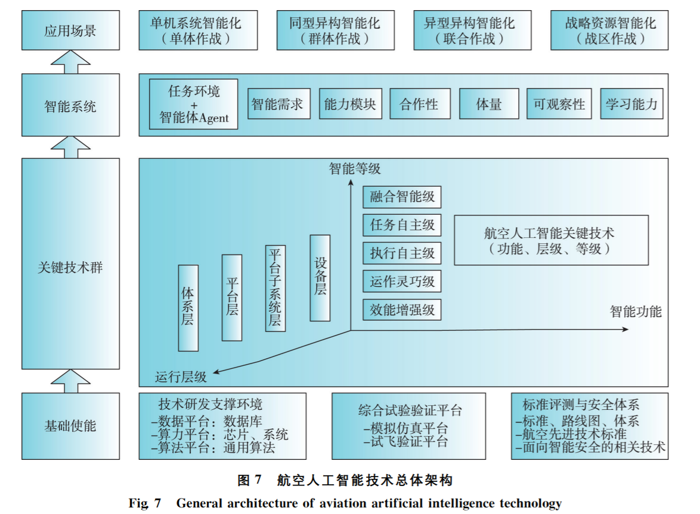

### 机载智能任务计算机

---

机载计算机

今天飞机已成为重要的交通工具，为了更好的控制飞机，工程师们在飞机上安装了各种设备，例如仪表盘，无线电台控制系统，导航系统等，这些装置被称为机载设备。在上世纪七十年代之前，机载设备都是机械式的，各自独立发挥作用。随着大规模集成电路的发展，计算机的体积越来越小，运算速度越来越快，工程师们便将计算机安装在飞机上更好的控制各个系统工作。这些计算机被称为机载计算机。目前。世界各国的军用飞机和民用飞机都使用了大量的机载计算机，数百台机载计算机分布在飞机的各个部位，通过机载网络紧密相连形成各种机载系统，保证飞行安全和关键任务的实现。计算机的使用大幅提高了飞机的安全性，可靠性，和舒适性，彻底改变了飞机的驾驶方式和乘坐体验。

机载计算机与我们常见的家用计算机的区别：首先，机载计算机是专用设备，仅仅用来完成一项或几项特定任务，软件和硬件高度集成，管理和使用需要专门的工具。而家用计算机是通用设备，软件和硬件都可以直接更换。其次，机载计算机具有抗恶劣环境的能力，家用工作环境如果太冷太热太潮湿计算机都会死机，机载计算机要求在各种温度各种湿度剧烈震动腐蚀性电磁辐射等恶劣环境下都能保持稳定工作。第三，机载计算机还必须具备高安全、强实时、高可靠的特点。为此工程师采用特殊的计算机架构设计，不仅对操作指令能够快速响应，即使在某台计算机发生故障的情况下其他计算机能也瞬间接替他继续工作，完成指定的任务。此外机载计算机的研制也有着极为严格的要求，工程师必须依据相应的技术标准，开展设计，生产和实验，必须使用专门的设计工具，实验工具和检验工具，确保每一项性能指标都符合设计制造要求。

- 硬件
  - 
- 软件
  - 系统架构
    - ~~[朱立平.2019.3] 一种基于ＦＡＣＥ标准的飞行器管理系统软件架构。~~
    - [雷宏杰.2020.1] 面向军事应用的航空人工智能技术架构研究。
      - 
    - [文鹏程.2021.3] 设计了机载智能计算系统架构研究了智能加速硬件、智能服务软件、智能开发工具等核心要素，但是没有从全机机载系统的角度进行分析。
    - [任宝平.2023.8] 机载系统智能架构融合了云 —边—端协同计算技术、分布式综合模块化航电系统架构技术和分布式网络控制系统技术。该智能架构按照云、边、端三类设备构建。
    - 

智能任务

- 算法
- 硬件
- 应用

---

题为《国外航空机载系统发展历程及启示》的文章,我进行了以下分析和总结:

一、文章概述

本文通过分析国外航空机载系统的发展历程,总结其经验启示,为我国航空机载系统的发展提供借鉴。

二、国外机载系统发展经验

1. 美国政府通过专项计划推动机载系统技术研发,实现技术领先。
2. 机载系统企业实现从制造商到系统集成商的转变,具备完整的研发验证体系。
3. 采用信息化手段实现机载系统的资源共享和协同研发。
4. 强大的研发条件支撑机载技术和产品的快速迭代升级。

三、对我国的启示

1. 加强基础研究投入,实现机载系统自主创新。
2. 建立完整的机载研发体系,提升整体研发能力。
3. 运用数字化等手段改进研发流程。
4. 增加政府支持,扩大机载系统投入力度。

四、文章总结

本文通过剖析国外航空机载系统发展历程,指出我国应加强前期技术研究,建立独立的研发体系,运用数字化等手段提升研发能力,并增加政府支持力度,以实现机载系统的自主创新和跨越发展。

---

[朱立平.2019.3] 一种基于ＦＡＣＥ标准的飞行器管理系统软件架构。

一、导言

1. 背景:飞行器管理系统软件架构应用FACE标准存在的兼容性问题

二、飞行器管理系统架构分析

1. 系统架构组成:OSS、IOSS、PSSS、TSS、PCS
2. IO服务需求分析 
3. PSSS和IOSS的功能划分

三、基于FACE的飞行器管理系统设计

1. IOSS设计

(1) IO设备抽象层

(2) IOSS与PSSS接口设计 

(3) IOSS优化设计

2. TSS设计
3. 基于FACE的样机实现

四、结束语

- 总结:模块化设计思想,解决软件兼容问题
- 提出的技术手段和设计思想值得借鉴

1. 文章首先提出了飞行器管理系统软件架构应用FACE标准存在的兼容性问题。
2. 然后提出了IO服务段和平台特定服务段的功能划分方法,使两者可以很好地兼容。
3. 对IO服务段进行了设计,采用接口调用表加速接口调用,实现低延时。
4. 对传输服务进行了设计,选择DDS作为 FACE 传输服务。
5. 搭建了基于FACE标准的飞行器管理系统样机,并进行了端到端延时实验,证明所提出的架构是有效和可行的。
6. 文章采用模块化设计思想,很好地解决了软件复用和兼容的问题,为飞行器管理系统软件的开发提供了参考。
7. 文中涉及的关键技术有:FACE标准、软件架构设计、实时性分析等。
8. 这篇文章对飞行器管理系统软件架构设计进行了很好的探索,其设计思想和技术手段值得借鉴。

---

题为《机载系统的智能架构及功能分析》的文章进行了全面分析和总结,报告如下:

一、文章研究背景

本文分析了机载系统正朝着高度综合化、智能化和自动化的方向发展。随着交联关系的日益复杂,对机载系统硬件资源提出了更高需求,而硬件升级速度相对缓慢,因此存在矛盾。同时,应用智能技术解决态势感知、任务规划等问题的需求也在增长。基于此,文章提出一种机载系统智能架构方案。

二、文章研究内容

1. 介绍了设计该架构所采用的三种关键背景技术,分别是云-边-端协同技术、分布式网络控制系统技术和分布式综合模块化航电系统技术。
2. 提出了机载系统智能架构方案。该架构采用云管理平台、边缘控制平台、终端平台三层架构,配置高速实时网络,利用**容器软件技术**实现系统功能的应用程序化。
3. 分析了该架构除了传统功能外,还具备的四种智能功能:机载系统APP自我进化、热维护、系统软件远程升级和易扩展功能。

三、文章主要结论

1. 该架构可以提高多机载系统的综合化程度,而不增加复杂性。
2. 该架构方便人工智能、数据融合等新技术的应用和新功能的扩展。
3. 该架构具有一定通用性,可以应用于有人和无人机载系统。
4. 该架构提供了一种解决机载系统高度复杂化与硬件资源缓慢升级速度矛盾的方案。

总体来说,本文针对机载系统发展趋势提出了一种创新性架构方案,分析论证了其优势所在,对推动机载系统向智能化方向发展具有一定的参考价值。

---

题目：==面向军事应用的航空人工智能技术架构研究==

一、导言

航空装备智能化发展现状
面向未来智能空战,需要明确军用航空人工智能的内涵
二、军用航空人工智能技术框架

人工智能系统信息作战模型
不同作战层次的智能升级途径
智能化装备作战层次
三、关键技术分析

基础支撑平台
关键技术组
智能系统
支撑保障体系
四、建议

加强基础理论研究
注重实战需求牵引
完善技术标准体系

这是一篇探讨面向军事应用的航空人工智能技术架构的文章。

首先,文章回顾了当前航空装备智能化发展现状,提出面向未来智能空战的需求,明确了军用航空人工智能的内涵。

然后,文章根据人工智能系统的信息作战模型,提出了不同作战层次航空装备的智能升级途径,并给出了智能化装备的作战层次划分。

接着,文章详细分析了军用航空人工智能技术框架,包括基础支撑平台、关键技术组、智能系统和支撑保障体系四个方面。针对关键技术组,文章根据作战层次、功能需求和基础支撑平台进行了分类分析。

最后,文章提出了改善我国航空装备智能化水平的建议:加强基础理论研究,注重实战需求牵引,完善技术标准体系。

总体来说,这篇文章立足我国国情,针对军用领域航空装备智能化提出了系统的技术框架和发展路线,对推进我国航空装备智能化转型具有重要参考价值。

---

题目：Genetic Fuzzy based Artificial Intelligence for Unmanned Combat Aerial  Vehicle Control in Simulated Air Combat Missions.  [2016]

这篇文章主要介绍了一种基于遗传模糊系统的人工智能ALPHA,用于控制无人战斗机在空战模拟环境中的行为。主要内容包括:

文章首先阐述了无人战斗机空战控制存在的困难,如大量输入输出变量、环境不确定性等,需要智能系统来进行控制。
然后介绍了一种遗传模糊树方法,可以高效地生成和优化复杂的模糊控制系统,应用于控制无人战斗机。
基于这种方法,开发了一个名为ALPHA的空战智能体,可以控制多架无人战斗机进行团队作战。文章给出了ALPHA的系统框架、学习过程等详细信息。
在高保真的空战模拟环境中,ALPHA展现出了非常强悍的战斗能力,可以打败之前的基线控制器,甚至击败了有实战经验的人类飞行员。
最后,文章总结了这种遗传模糊系统在复杂控制问题中的优势,如高性能、可验证性、计算效率等,在无人机控制和其他领域有广泛应用前景。

---
