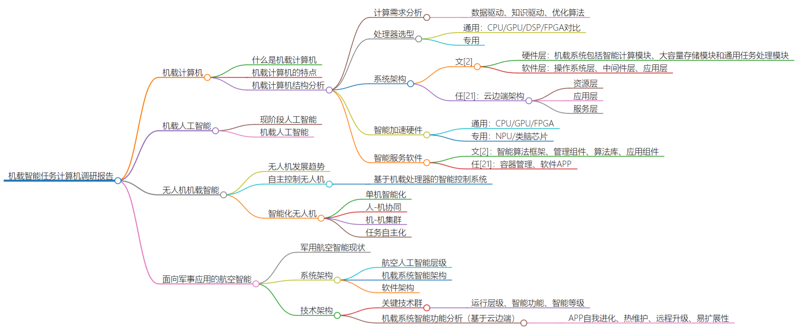

## 机载智能任务计算机调研报告

### 机载计算机

- 什么是机载计算机
- 机载计算机的特点
- 机载计算机结构分析
  - 计算需求分析
    - 数据驱动、知识驱动、优化算法
  - 处理器选型
    - 通用：CPU/GPU/DSP/FPGA对比
    - 专用：谷歌的 TPU、IBM 的 TrueNorth、以及寒武纪 MLU100、华为 Ascend310、地平线“旭日”“征程”、清华大学 Tianjic、浙江大学 Darwin
  - 系统架构
    - 文[2]
      - 硬件层：机载系统包括智能计算模块、大容量存储模块和通用任务处理模块
      - 软件层：操作系统层、中间件层、应用层
    - 任[21]：云边端架构
      - 资源层
      - 应用层
      - 服务层
  - 智能加速硬件
    - 通用：CPU/GPU/FPGA
    - 专用：NPU/类脑芯片
  - 智能服务软件
    - 文[2]：智能算法框架、管理组件、算法库、应用组件
    - 任[21]：容器管理、软件APP

### 机载人工智能

- 现阶段人工智能
- 机载人工智能

### 无人机机载智能

- 无人机发展趋势
- 自主控制无人机
  - 基于机载处理器的智能控制系统
- 智能化无人机
  - 单机智能化
  - 人-机协同
  - 机-机集群
  - 任务自主化

### 面向军事应用的航空智能 

- 军用航空智能现状
- 系统架构
  - 航空人工智能层级
  - 机载系统智能架构
  - 软件架构
- 技术架构
  - 关键技术群
    - 运行层级、智能功能、智能等级
  - 机载系统智能功能分析（基于云边端）
    - APP自我进化、热维护、远程升级、易扩展性
